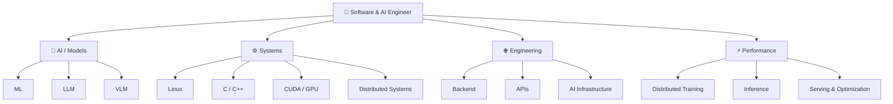

# 👋 Welcome!

Hi! I'm **Behnam** — a Computer Science student who somehow keeps finding new rabbit holes in computer science.

<div align="center">
  
  <p><b>AND IT'S SO NICE TO MEET YOU!</b></p>
</div>

---

## 🌌 About Me

I'm a **Computer Science student focused on Artificial Intelligence and Machine Learning**, with a particular interest in understanding what happens underneath the abstractions.

My current interests sit somewhere between **AI research, LLM engineering, systems programming, and software engineering**.

* 🤖 **AI / ML Engineer** — Working mainly with Python, PyTorch, Transformers, and modern ML workflows. Currently diving deeper into LLMs, fine-tuning, reinforcement learning, and distributed training.
* 🧠 **LLM Explorer** — Interested in how language models are built, trained, fine-tuned, evaluated, and eventually deployed.
* ⚙️ **C/C++ Enthusiast** — Algorithms, data structures, memory, performance, and low-level programming.
* 🐍 **Python Developer** — My primary language for machine learning, experimentation, automation, and research.
* 🖥️ **Low-Level Fan** — Debuggers, memory layouts, operating systems, embedded systems, CUDA... if it gets closer to the metal, I'm probably interested.
* 🌐 **Software Engineer** — Experience with backend development and APIs using Node.js and Go, with previous experience building front-end applications using JavaScript and React.
* 📊 **Data & Research** — Interested in data analysis, experimentation, and turning messy data into something useful.

I'm particularly interested in the boundary between **high-level AI abstractions and the systems underneath them**.

> “Data! Data! Data! I can't make bricks without clay.”
> — *Arthur Conan Doyle*

---

## 🧪 What I'm Exploring

My learning path is currently centered around a few interconnected areas:



The goal isn't just to use AI libraries.

I want to understand **what is actually happening underneath them.**

---

## 🛠️ Technologies

<!--These are cute, so I want to use them here to make this readme.md cute:-->

<div align="center">

### Languages


### AI / Machine Learning


### Development


</div>

---

## 🚀 Projects & Experiments

A lot of my repositories are experiments rather than polished products.

That's intentional.

I'm interested in building things to understand them — from machine-learning models and LLM experiments to backend systems and low-level programming projects.

Some projects may be rough.

Some may be unfinished.

Some may be completely unnecessary.

But almost all of them started with the same question:

> **"What happens if I actually build it myself?"**
> — *Behnam*

---

## 📊 GitHub Summary

<div align="center">
  
  
</div>

<div align="center">
  
  
</div>

<div align="center">
  
</div>

<br />

> “The computer was born to solve problems that did not exist before.”
> — *Bill Gates*

---

## 😁 Fun Fact

I can use **C/C++ in JavaScript**, You may ask how ... Here you see:

```javascript
for (let C = 0; C < 5; C++) {
    console.log("see?");
}
```

> C++ never forgave me...
> but I forgave myself. 😎
>
> — *Behnam*

---

## 🌐 Connect With Me

<div align="center">

<a href="https://t.me/sirunchained">
  
</a>

<a href="mailto:bbehnam3831@gmail.com">
  
</a>

<a href="https://github.com/sirunchained">
  
</a>

<a href="https://huggingface.co/sirunchained"> 
   
</a>

<br />
<br />


</div>
